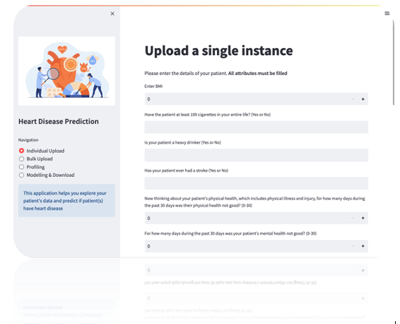
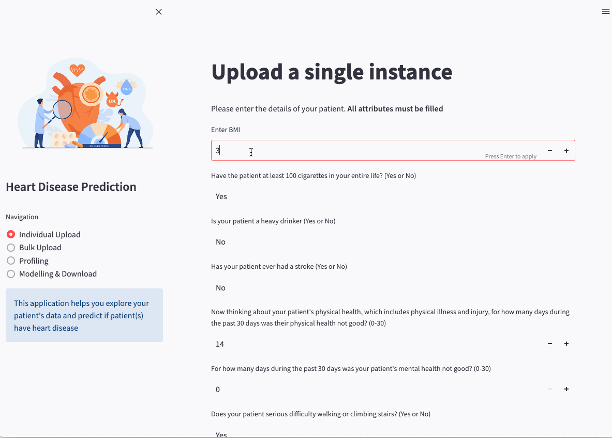
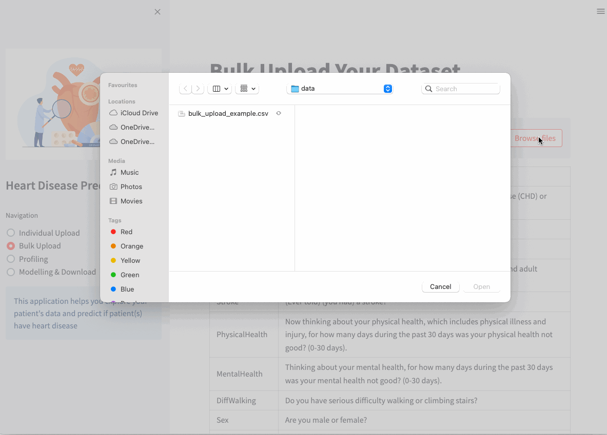
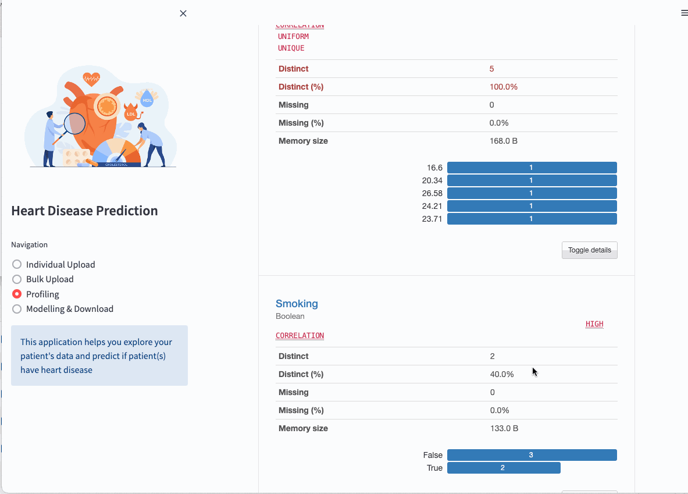
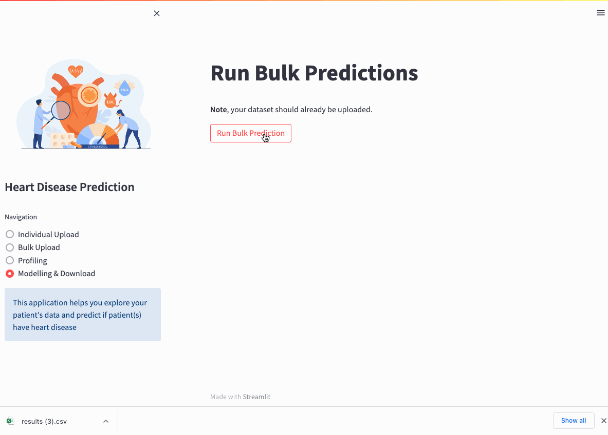

<h1 align="center">
  
  <br/>
  Heart Disease Analysis & Prediction App
</h1>
<h3 align="center">
  Anthony Reidy
  <br/><br/><br/>
</h3>

## Table of Contents
- [Table of Contents](#table-of-contents)
- [Development](#development)
- [Usage](#usage)
  - [Single Instance Upload View](#single-instance-upload-view)
  - [Bulk Upload View](#bulk-upload-view)
  - [Profiling View](#profiling-view)
  - [Modelling & Download View](#modelling--download-view)

## Development
It is good practice to develop in a virtual environment. Note, this jupyter book was written using `python 3.7` and on the `MAC` operating system (OS). As such, all commands are setup for this installation and may not work for other OS's. To create a virtual environment called `venv`, execute:
```bash
python3 -m venv venv
```
To activate it, execute
```bash
source venv/bin/activate
```

- Execute `pip install -r requirements.txt` to install requirements for development.

## Usage
To run app, execute
```bash
streamlit run app.py
```
while in the *app* directory. The app should now be available at `http://localhost:8508/`

There are *four* views available to the user, depending on their need.

### Single Instance Upload View

A forum is presented to the user where they can input a patients details'. All attributes must be filled. If not, a error is returned to the user describing the missing column. Once the predict button is clicked, the predicted class is presented (either the patient does or does not have heart disease). Also, the probabilities of the patient belonging to each class are displayed in a bar chart).



### Bulk Upload View
A view that allows the user to bulk upload patients in CSV format. Once it has been uploaded, a window displaying the uploaded data will appear. 



### Profiling View
Displays a [pandas profiling report](https://pandas-profiling.ydata.ai/docs/master/index.html) of the bulk uploaded data. For each column, the following information (whenever relevant for the column type) is presented in an interactive HTML report:

- Type inference: detect the types of columns in a DataFrame
- Essentials: type, unique values, indication of missing values
- Quantile statistics: minimum value, Q1, median, Q3, maximum, range, interquartile range
- Descriptive statistics: mean, mode, standard deviation, sum, median absolute deviation, coefficient of variation, kurtosis, skewness
- Most frequent and extreme values
- Histograms: categorical and numerical
- Correlations: high correlation warnings, based on different correlation metrics (Spearman, Pearson, Kendall, Cramér’s V, Phik, Auto)
- Missing values: through counts, matrix, heatmap and dendrograms
- Duplicate rows: list of the most common duplicated rows
- Text analysis: most common categories (uppercase, lowercase, separator), scripts (Latin, Cyrillic) and blocks (ASCII, Cyrilic)




### Modelling & Download View

The user clicks on `Run Bulk Predictions` button to retrieve the predicted class for each patient. Once the inference has completed, a green success message is presented. The user can download the results, by pressing the `Press to Download Results` button. A CSV is then downloaded onto the user's local machine, containing 
the original data supplied by the user, along with a new column called "PredictedHeartDisease".

